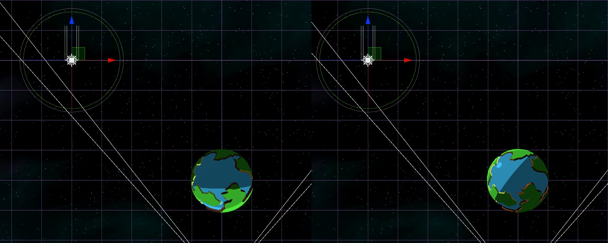

# Omnidirectional Shader Graph

A simple experiment to create an Omnidirectional Light source. Similar to a point light, but with no falloff. 
A directonal light has no position, just a direction. So all objects lit by a directional light are lit "as if the light is point at it from 
the direction of the directional light" regardless of where you have placed it in your scene. For the real world, this is essentially how sunlight works.

An Omnidirectional is a sort of the opposite. It lights an object based on it's position. Think of it as a point light with no falloff. 

On the left is a directional light. Despite it's position, it is lighting the planet from "below".
On the right is an omnidirectional light. 

This project has no fancy graphics, just a simple example.

It consists of an OmnidirectionalLight monobehaviour that is placed on the object in the scene that defines the lights position and a shadergraph that
uses that position to calculate the light direction.

This has been set up in the scene called SolarSystem. It has a very rudimentary orbit script placed on some spheres, each of which are using the OmnidirectionalLit shader graph.
There is also a larger yellow sphere with the OmnidirectinalLight component on it. 
